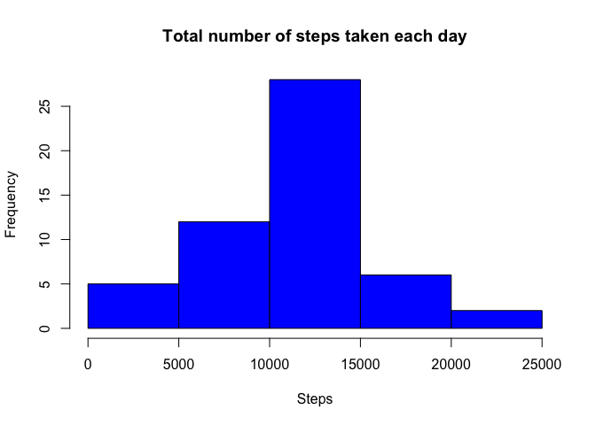
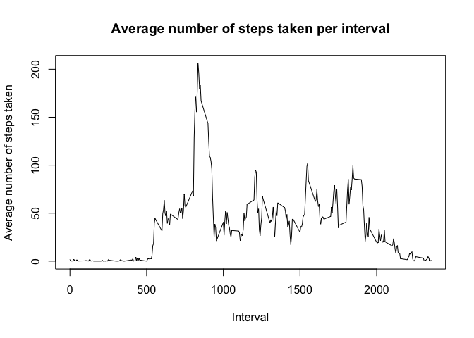
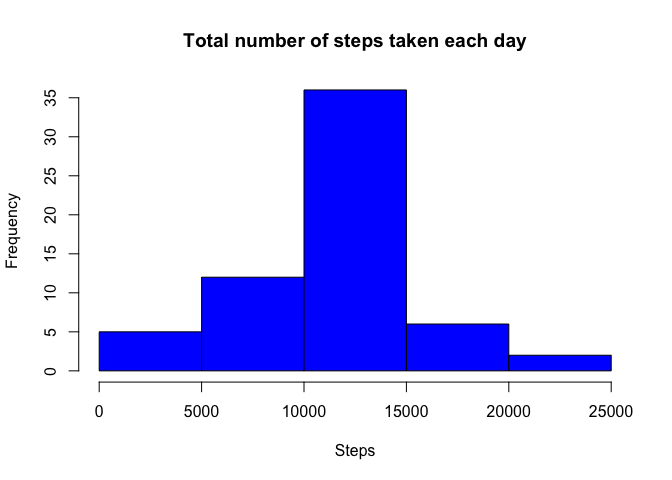
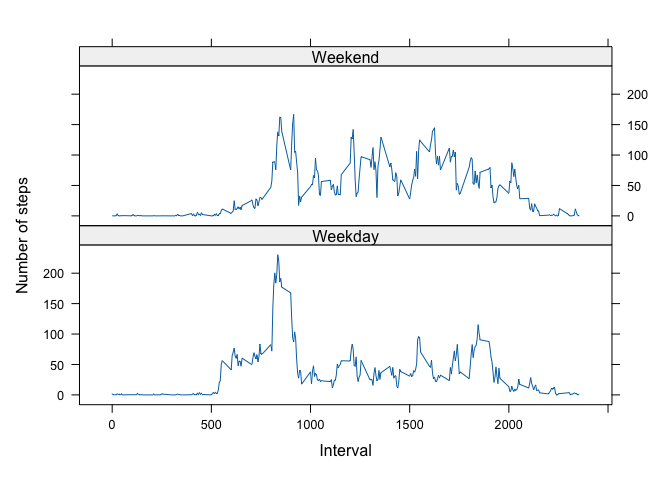

## Loading and preprocessing the data


```r
# Load the data
activity <- read.csv("activity.csv")
activity$date <- as.Date(activity$date, "%Y-%m-%d")
str(activity)
```

```
## 'data.frame':	17568 obs. of  3 variables:
##  $ steps   : int  NA NA NA NA NA NA NA NA NA NA ...
##  $ date    : Date, format: "2012-10-01" "2012-10-01" ...
##  $ interval: int  0 5 10 15 20 25 30 35 40 45 ...
```

## What is mean total number of steps taken per day?


```r
# calculate the total number of steps taken per day
total_steps <- aggregate(steps ~ date, activity, sum)
head(total_steps)
```

```
##         date steps
## 1 2012-10-02   126
## 2 2012-10-03 11352
## 3 2012-10-04 12116
## 4 2012-10-05 13294
## 5 2012-10-06 15420
## 6 2012-10-07 11015
```


```r
# make a histogram of the total number of steps taken each day
hist(total_steps$steps, main = "Total number of steps taken each day", xlab = "Steps", col = "blue")
```




```r
# calculate and report the mean and median of the total number of steps taken per day
mean(total_steps$steps)
```

```
## [1] 10766.19
```


```r
median(total_steps$steps)
```

```
## [1] 10765
```
**The mean of the total number of steps taken per day is 10766.19 and the median is 10765.**

## What is the average daily activity pattern?


```r
# make a time series plot of the 5-minute interval and the average number of steps taken, averaged across all days (y-axis)
avg_steps <- aggregate(steps ~ interval, activity, mean)
head(avg_steps)
```

```
##   interval     steps
## 1        0 1.7169811
## 2        5 0.3396226
## 3       10 0.1320755
## 4       15 0.1509434
## 5       20 0.0754717
## 6       25 2.0943396
```

```r
# plot the average number of steps taken
plot(avg_steps$interval, avg_steps$steps, type = "l", xlab = "Interval", ylab = "Average number of steps taken", main = "Average number of steps taken per interval")
```




```r
# which 5-minute interval, on average across all the days in the dataset, contains the maximum number of steps?
avg_steps[which.max(avg_steps$steps), ]$interval
```

```
## [1] 835
```
**The 5-minute interval, on average across all the days in the dataset, that contains the maximum number of steps is 835.**

## Imputing missing values


```r
# calculate and report the total number of missing values in the dataset (i.e. the total number of rows with NAs)
sum(is.na(activity$steps))
```

```
## [1] 2304
```

**The total number of missing values in the dataset is 2304.**


```r
# a strategy for filling in all of the missing values in the dataset
# create a new dataset (data) that is equal to the original dataset (activity) but with the missing data filled in
# strategy: replace each missing value with the mean value of its 5-minute interval

# get all the rows with NA values
na_rows <- activity[is.na(activity$steps), ]

# fill the NA values with the mean value of its 5-minute interval
na_rows$steps <- sapply(na_rows$interval, function(x) avg_steps[avg_steps$interval == x, ]$steps)

# new dataset with the missing data filled in
data <- rbind(na_rows, activity[!is.na(activity$steps), ])
```

```r
# check the NAs in new dataset data
sum(is.na(data$steps))
```

```
## [1] 0
```


```r
# make a histogram of the total number of steps taken each day
total_steps2 <- aggregate(steps ~ date, data, sum)
hist(total_steps2$steps, main = "Total number of steps taken each day", xlab = "Steps", col = "blue")
```




```r
# calculate and report the mean and median of the total number of steps taken per day
mean(total_steps2$steps)
```

```
## [1] 10766.19
```


```r
median(total_steps2$steps)
```

```
## [1] 10766.19
```

**The mean of the total number of steps taken per day is 10766.19 and the median is 10766.19, and is slightly different to the original mean of 10766.19 and median of 10765**


What is the impact of imputing missing data on the estimates of the total daily number of steps?

**The impact of imputing missing data on the estimates of the total daily number of steps is that the mean and median are now equal.**


## Are there differences in activity patterns between weekdays and weekends?

```r
# a new factor variable in dataset with weekdat and weekend levels
data$day <- weekdays(data$date)
data$day_type <- ifelse(data$day %in% c("Saturday", "Sunday"), "Weekend", "Weekday")
data$day_type <- as.factor(data$day_type)

head(data)
```

```
##       steps       date interval    day day_type
## 1 1.7169811 2012-10-01        0 Monday  Weekday
## 2 0.3396226 2012-10-01        5 Monday  Weekday
## 3 0.1320755 2012-10-01       10 Monday  Weekday
## 4 0.1509434 2012-10-01       15 Monday  Weekday
## 5 0.0754717 2012-10-01       20 Monday  Weekday
## 6 2.0943396 2012-10-01       25 Monday  Weekday
```


```r
# make a panel plot containing a time series plot of the 5-minute interval and the average number of steps taken, averaged across all weekday days or weekend days (y-axis)

# calculate the average number of steps taken, averaged across all weekday days or weekend days
avg_steps2 <- aggregate(steps ~ interval + day_type, data, mean)

# plot the average number of steps taken
library(lattice)
xyplot(steps ~ interval | day_type, data = avg_steps2, type = "l", layout = c(1, 2), xlab = "Interval", ylab = "Number of steps")
```



**There are differences in activity patterns between weekdays and weekends.**
